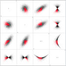

# Proportional Highlighting

Proportional highlighting is a technique of exploratory data analysis, an implementation of brushing and linking for aggregate graphs. Proportional highlighting is described in detail by [Stephen Few](https://www.perceptualedge.com/articles/visual_business_intelligence/coordinated_highlighting_in_context.pdf).

[This project demonstrates a user interface for proportional highlighting of linked visualizations.](https://hemanrobinson.github.io/proportional/)

